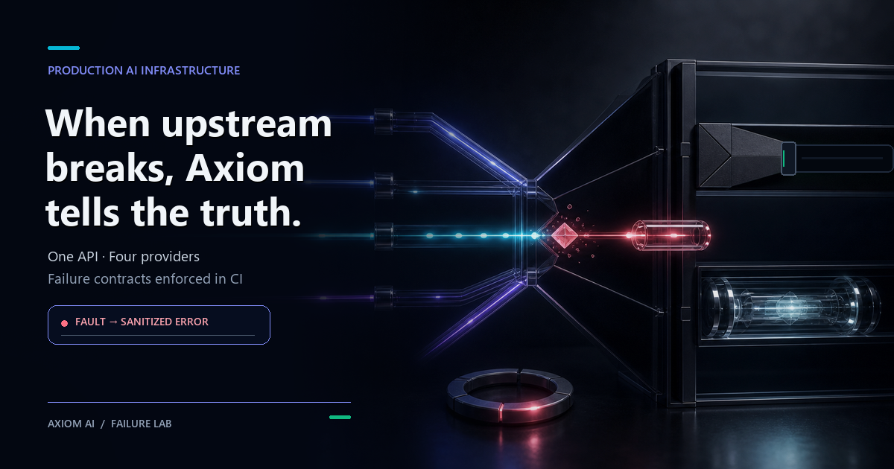

# Axiom AI

**Production-grade AI infrastructure** — Claude, GPT-5.5, Gemini 3.5, and Groq behind one clean REST API. 4 providers. 9 models. One endpoint.

[](https://fastapi.tiangolo.com)
[](https://python.org)
[](https://anthropic.com)
[](https://openai.com)
[](https://deepmind.google/technologies/gemini/)
[](https://groq.com)
[](https://railway.app)
[](https://github.com/Lancimoun/axiom-ai/actions/workflows/ci.yml)
[](LICENSE)

**Live:** [axiom-ai-production-aaec.up.railway.app](https://axiom-ai-production-aaec.up.railway.app)
**Failure Lab:** [live contract replay](https://axiom-ai-production-aaec.up.railway.app/#failure-lab)
**Docs:** [axiom-ai-production-aaec.up.railway.app/docs](https://axiom-ai-production-aaec.up.railway.app/docs)
**Health:** [axiom-ai-production-aaec.up.railway.app/health](https://axiom-ai-production-aaec.up.railway.app/health)



---

## What It Is

A quad-provider AI API that routes requests to **Claude (Anthropic)**, **GPT-5.5 (OpenAI)**, **Gemini (Google)**, or **Groq (LPU)** behind a single, unified interface. Switch providers and models per-request with one field. No SDK swaps. No re-implementation. 9 models total.

Built with production concerns from day one: API key auth, per-IP rate limiting, CORS, real-time SSE streaming, multi-turn session memory, and usage analytics.

**State boundary:** sessions and usage counters are process-local and reset when the service restarts or redeploys. They demonstrate API and failure semantics; they are not durable storage.

---

## Endpoints

| Method | Path | Auth | Description |
|---|---|---|---|
| `GET` | `/` | — | Landing page |
| `GET` | `/ping` | — | Ultra-light liveness probe |
| `GET` | `/health` | — | Status, uptime, usage stats (JSON) |
| `GET` | `/models` | — | Public provider + model metadata (never credentials) |
| `GET` | `/usage` | ✓ | Cumulative token + request analytics |
| `POST` | `/ask` | ✓ | Single-turn Q&A |
| `POST` | `/chat` | ✓ | Multi-turn conversation with session memory |
| `POST` | `/stream` | ✓ | Real-time streaming via Server-Sent Events |
| `GET` | `/benchmark/probes` | — | Reliability probe suite |
| `POST` | `/benchmark/reliability` | ✓ | Run the same reliability probes across providers |
| `GET` | `/session/{id}` | ✓ | View conversation history |
| `DELETE` | `/session/{id}` | ✓ | Clear a conversation |
| `GET` | `/docs` | — | Interactive API reference |

---

## Quickstart

```bash
# Single-turn Q&A — Claude
curl -X POST https://axiom-ai-production-aaec.up.railway.app/ask \
  -H "Content-Type: application/json" \
  -H "X-API-Key: YOUR_KEY" \
  -d '{"question": "What is RAG?", "provider": "claude"}'

# Multi-turn chat — OpenAI
curl -X POST https://axiom-ai-production-aaec.up.railway.app/chat \
  -H "Content-Type: application/json" \
  -H "X-API-Key: YOUR_KEY" \
  -d '{"message": "Hello!", "provider": "openai"}'

# Real-time streaming
curl -N -X POST https://axiom-ai-production-aaec.up.railway.app/stream \
  -H "Content-Type: application/json" \
  -H "X-API-Key: YOUR_KEY" \
  -d '{"question": "Explain transformers", "provider": "claude"}'

# Reliability leaderboard run — Claude vs GPT vs Gemini vs Groq vs Maxima
curl -X POST https://axiom-ai-production-aaec.up.railway.app/benchmark/reliability \
  -H "Content-Type: application/json" \
  -H "X-API-Key: YOUR_KEY" \
  -d '{"providers": ["claude", "openai", "gemini", "groq", "maxima"], "include_responses": false}'
```

---

## Stack

| Layer | Technology |
|---|---|
| Framework | FastAPI + Uvicorn |
| AI Providers | Claude (Anthropic) · GPT-5.5 (OpenAI) · Gemini (Google) · Groq LPU |
| Gemini SDK | Supported Google GenAI SDK (`google-genai` 2.x) |
| Models | 9 total across 4 providers |
| Streaming | Server-Sent Events (SSE) |
| Auth | API Key (`X-API-Key` header) |
| Rate Limiting | slowapi — 20 req/min per IP |
| Deployment | Railway · Docker |
| Language | Python 3.11 |

---

## Features

- **Quad provider** — Claude, GPT-5.5, Gemini, and Groq behind one API, switchable per request
- **9 models** — Haiku 4.5 / Sonnet 4.6 / Opus 4.7 · GPT-5.4 Mini / GPT-5.5 · Gemini 3.5 Flash / 3.5 Pro · Llama 3.3 70B / Llama 3.1 8B
- **Streaming** — real-time token-by-token output via SSE from all 4 providers, with one explicit terminal event
- **Multi-turn chat** — process-local session memory with a rolling 20-message window; failed provider calls never commit half a turn
- **RAG-ready** — pass `context` to any `/ask` call to ground answers in your data
- **Custom system prompts** — override persona per request
- **Usage analytics** — process-local totals for requests and tokens, broken down by provider and endpoint
- **Auth + rate limiting** — production-safe out of the box
- **Reliability benchmark** — inspect 15 provider-free Arena foundation probes, then opt into running 1–15 of them across configured providers for leaderboard-ready reports
- **Failure-contract lab** — cinematic, provider-free replays of the tested stream, configuration, session, and retry boundaries; reduced-motion aware and explicit that no live provider call is running

---

## Failure Contract

Axiom's provider boundary is deterministic and credential-free under test:

- a provider known to be unconfigured returns `503` before an SSE stream starts
- a provider failure after streaming begins emits one named `error` event and never a false `done`
- stream errors carry stable `code` and `retryable` fields without exposing raw SDK exception text
- failed chat calls leave the existing session unchanged
- OpenAI retry ownership stays in the SDK; Axiom does not stack another retry loop around it

Example terminal stream failure:

```text
event: error
data: {"error": "OpenAI stream failed.", "code": "upstream_failure", "retryable": false}
```

All provider, retry, and SSE contracts use local fakes in CI. They do not require API keys or paid inference.

The [live Failure Lab](https://axiom-ai-production-aaec.up.railway.app/#failure-lab) turns those exact contracts into an interactive public narrative. It is a deterministic replay—not a simulated provider benchmark—and its copy is pinned by the landing-page contract test.

### Verify locally

```bash
python -m pip install -r requirements-dev.txt
python run_tests.py
```

---

## Reliability Benchmark

Axiom carries Arena's **15-case provider-free foundation pack** at `cases/arena_foundation.json`. Inspecting the catalog makes no provider request:

```bash
curl https://axiom-ai-production-aaec.up.railway.app/benchmark/probes
```

The catalog covers stale-memory override, decision transparency, tool honesty, complete replies, unknown-memory boundaries, prompt injection, secret handling, citation honesty, uncertainty calibration, action honesty, contradiction resolution, malformed-output handling, idempotent retries, response shape, and evidence-before-completion claims.

The authenticated benchmark endpoint can run any selected prefix from **1 to 15** across configured providers. Its default remains **5** to bound accidental usage; this POST can consume provider credits:

```bash
curl -X POST https://axiom-ai-production-aaec.up.railway.app/benchmark/reliability \
  -H "Content-Type: application/json" \
  -H "X-API-Key: YOUR_KEY" \
  -d '{
    "providers": ["claude", "openai", "gemini", "groq", "maxima"],
    "max_probes": 5,
    "include_responses": true
  }'
```

The endpoint returns:

- provider scores
- per-probe checks
- latency and token totals
- a sorted leaderboard
- honest `skipped` rows for providers that are not configured

Expanding the local catalog from five to fifteen does **not** rewrite the dated provider leaderboard. Those historical scores remain a separate five-prompt × three-run snapshot until a new paid comparison is explicitly authorized and run.

Maxima is optional and never faked. Set `MAXIMA_BENCHMARK_URL` to a callable Maxima endpoint before expecting a Maxima score.

---

## Environment Variables

```env
ANTHROPIC_API_KEY=your_anthropic_key
OPENAI_API_KEY=your_openai_key
GEMINI_API_KEY=your_gemini_key     # optional — enables Google Gemini
GROQ_API_KEY=your_groq_key        # optional — enables Groq LPU inference
SERVICE_API_KEY=your_service_key   # leave empty for open dev access
MAXIMA_BENCHMARK_URL=https://your-maxima-endpoint.example/ask  # optional — enables Maxima benchmark row
MAXIMA_API_KEY=your_maxima_key      # optional — sent as X-API-Key to Maxima benchmark URL
```

---

## Gemini SDK Contract

Axiom uses Google's supported `google-genai` SDK through one injectable client shared by synchronous and streaming paths. Local fakes pin multi-turn role conversion, system instructions, output-token limits, streamed token order, usage accounting, sanitized failures, and the single terminal `done` event. CI never needs a Gemini key or paid inference; `/health` exposes only the non-secret SDK name for live deployment verification.


## Further reading

[**Your AI agent's tests are lying to you**](https://lancimoun.github.io/writing/fake-tests.html) — Axiom's contract tests pin behaviour without a paid key. This is what it looks like when tests like those pass while checking nothing.

---

> Built with Claude Code 💛⚡
